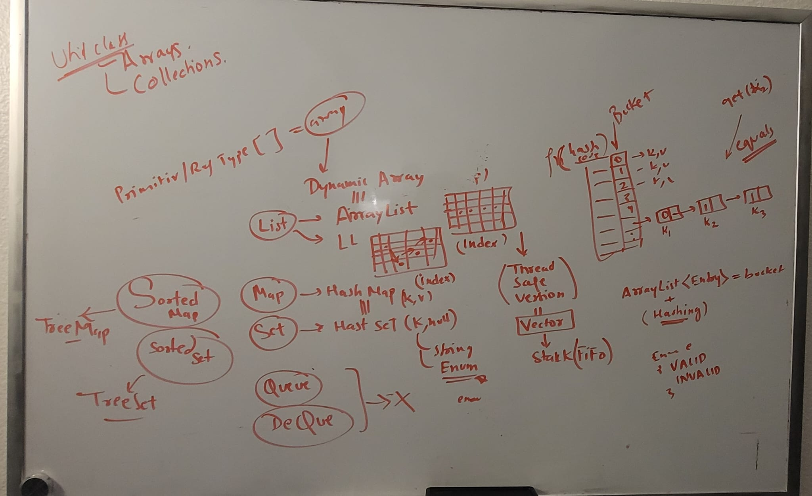

# Java 7
## References
- Core java 1 : https://chatgpt.com/c/3d0ee54a-34c7-4501-9fbe-f9fb21479339 :green_circle:
- Core java 2 : https://chatgpt.com/c/518e4a83-d192-428a-a2a0-c45ee9b0bb17 :green_circle:
- Core java 3 collection  : https://chatgpt.com/c/eb94768c-122d-49d4-955b-2d5d46cfe1c0 :green_circle:
- Core java 4 collection  :https://chatgpt.com/c/d1a3d740-2904-4a27-8132-3b26f96387c8 :green_circle:
- Core java 5 collection - `LIST` : https://chatgpt.com/c/82cc34ae-de89-4672-b43d-65e94730a382
- Core java 6 collection - `MAP` : https://chatgpt.com/c/c50132a3-ca62-4b2a-b868-7ed1d5f61af5
---
## Fundamental:
- JVM JRE JDK classLoader/ Memory Model : GC, heap,stack,permGen etc.
  - custom ClassLoader - load classes from `non-standard sources`(databases, network-locations, or encrypted files)
  - dynamic loading : classes at runtime based on certain conditions, user-input,etc.
- SourceCode --> [compile]  byteCode --> [interpreter] --> execute
  - frequently executed byteCode -->  [JIT] --> native machine-code
  - `JIT Compile` (performance)
    - identifies portions of the bytecode that are `frequently executed`
    - Compiles them into native machine-code at runtime.
    - native code is cached and reused.
    
- more building-blocks:
  - Operators & precedence, Expression & statement
  - control/conditional statement, switch expression & block
  - loop with break/continue.

    
- primitives types/8:
  - char and boolean
  - Number :
    - byte, int **, short, long
    - float -     Sign (1 bit) | Exponent (8 bits) | Mantissa (23 bits)
    - double ** - Sign (1 bit) | Exponent (11 bits) | Mantissa (52 bits)
  - `Strictfp`
    - mark on - class and method,
    - fp calculation based on IEEE-754 standard, to achieve consistent result on all platform/os
    - use double over float.
      
- More Reference Type : WrapperForPrimitive with autoboxing, 
  - `BigInteger`: immutable, java.math, mathematical operations for large int value outside range of long. rich API at bit manipulation level.
  - `AtomicInteger`, lock-free thread-safe 
  - `BigDecimal` : high-precision arithmetic, overcome rounding issue with float,Double
  - `varargs` in methods : 
    - variable-length arguments. eg: psvm(String[]), psvm(String...)
    - can have only one vararg, and must be last arg.

- more datatype:
  - `BigDecimal`
    - handle very large and very small numbers with a high degree of accuracy
    - represents numbers in a **decimal format**, avoiding these issues and ensuring that calculations involving decimals remain accurate
    - provides various rounding modes (e.g., HALF_UP, HALF_DOWN, FLOOR, etc.)
    - requires more memory and processing time.

  - `BigInteger`
--- 
## Multi-threading
- **Multi-threading / Parallel Processing** (not using much, why ?)
  - Web applications are generally stateless, with each request handled independently. 
  - **Modern web server/application** 
    - designed to handle multiple requests concurrently
    - And automatically create and manage threads to process incoming HTTP requests, using **threadpools**
    - so developer don't write it.
  - **Complexity** : race conditions, deadlocks, and synchronization problems (thread safe)
  - **Distributed Systems**
    - modern web applare designed to run in distributed environments (e.g., microservices architecture).
    - In such systems, multi-threading at the application level is less beneficial because tasks are distributed across multiple instances and nodes, 
    - each running independently.
  - Alternative: 
    - **Asynchronous Programming** for non-blocking operation.
    - **Message Queues**: 
      - For processing intensive or long-running tasks, web applications can use message queues (e.g., RabbitMQ, Kafka)
      - to decouple task execution from user requests,
      - allowing tasks to be handled asynchronously in the background.
- race condition
  - Concurrent Access on shared resource, leads to unpredictable result. 
  - outcome depends on the sequence or timing of the thread execution
  - thus give,  Data Corruption,  Inconsistent States,  Security Risks (eg: race con in authentication.)
  - avoid : sync block, locks, atomic variable, volatile keyword, immutable object, avoid shared resource, use Thread safe DS.
- `volatile` keyword
  - indicate that a variable's value will be modified by different threads
  - ensures that every read of the variable is done directly from the main memory and not from a thread's local cache
---   
## OOPS 
  - Concepts to create modular, maintainable, and scalable Java applications
  - class(Enum/Record), object, access specifier, immutable class, Encapsulation
  - inheritance, abstraction, Association(has-a)/dependencies.
  - constructor chaining and `static-block/s`
  - Interface / built-in marker-interface
    - `private final static` feilds / constants
    - `public` abstract method
    - more flexibility after java 8.
  - Polymorphism - override and overload
  - keywords : this, super, this(), super(), final, static 
  - More on classes:
    - `Generic class / interface`
      - improved typing, compile-time type safety.
      - if myClass is operating on multiple types, make it generic.
      - wildcard : <?>, <T>, <T extends MyType>,  <? extends MyType>, <? extends T>
    - `SingleTon Class, inner class, annonymous Class`
    - `Immutable class`:
      - final class, final method, final property
      - no setter,
      - make defensive copies... create new object.
      
- **some fact**:
  - Constructors are not inherited by subclasses, but a subclass constructor implicitly calls a superclass constructor before executing its own code.
  - In inheritance, subclass can provide broader value for overridden method : `accessSpecifier`, throws `exceptionType`, covariant `returnType`.
  - Overloaded methods are resolved at compile time.
  - static-import
  - public abstract `sealed` class Shape  `permits` Circle, Rectangle, Square {} : control which classes can be subclasses. J18
  - Object : Deep / shallow copies
    - use <artifactId>commons-lang3</artifactId> : `SerializationUtils.clone()`

--- 
##  Strings (Immutable)
- bauldeng Q&A : https://chatgpt.com/c/0d16a9c0-8c29-4ccb-aec9-8a934e0c0e8b
- StringPool : intern()
- interface: `CharSequence` --> implementation --> string
- String Manipulation : charAt, length, substring, reverse, split, join
- StringBuffer(Thread-Safe) and StringBuilder(Mutable variant of String)
- `StringJoiner` - J8
  - sb.`append(i1).append(",")`.`append(i2).append(",")`
  - new StringJoiner(",").`join("i1")`.`join("i2")`  -- better
- replaceAll("\\s+", "") - remove all whitespace characters
- java 10
  -  "Lekhraj".`repeat`(3) //  "LekhrajLekhrajLekhraj"
  - `isBlank`() : check contains only `white space characters` .
  - `lines`() : Returns a Stream of lines extracted from the String, delimited by `\n,\r`
  - `strip, stripLeading, stripTrailing`() 
    - like `trim()`,  but Also removed `\u00A0` (non breaking space)
    - "    hello   ", "    hello", "hello   "
  - String.join(", ", strArray);
---
## Java Collection 

### Java Collection (Data structure) - commonly used
> - Side-Note:
>   - can think, Linked-list as tree with single branch.
>   - and, tree as object/s randomly stored on heap/main-memory with references.
>   - graph : circular, tree has end note.

  - `Array` : int[3], int{1,2,3} : Core DS.
  - **List** : 
    - `ArrayList` : internally Array [varyLength], dynamic Array-grows & shrinks.
    - `LinkedList` 
      - Nodes with forward/backward references. 
      - less efficient for random access.
      - adding/removing  -beginning or middle is fast.
    - `vector`: Thread-Safe version of ArrayList, provides sync methods. SLOW
    - `stack`** : vectors with additional methods: `push,pop,peek`. SLOW
    
  - **Map** 
    - `HashMap`<K,V>  
      - ArrayList(bucket) Of Entry(k,v)
      - hashCode(Key)== bucket/index on array + onCollision:add(Tree,J8+/Linked-list,J7)
      - null allowed, no ordering, O(1)
        
    - `HashTable` 
      - Thread-Safe of hashMap
      - null not allowed, thus slower.
      
    - **SortedMap** 
      - `TreeMap` : 
        - self-balancing BinaryTree(R&B), Entry/Nodes has reference to child entry/Nodes.
        - null NOT allowed, ordered, sub-map views, O(log n)
        
  - **Set** (no duplicate)
    - `HashSet`<V>      : HashMap<K,null> :: bucket -> ArrayList  Of Node
    - `LinkedHashSet`** : HashMap<K,null> :: bucket -> linkedList Of Node
    
    - **SortedSet** 
      - `TreeSet` : Treemap<K,null>

### Java Collection (Data structure) - NOT commonly used
- **Queue** : `priorityQueue` , `ArrayDeque`
- **DeQue** : `LinkedList` has also implemented methods from Deque Interface.
  - haven't used these above one, but using external one :: SQS, RMQ and Kafka for interApplication comm. 
  - can also use same for intra-app problems.

### Utility class:
- **Collections** : 
  - `toArray(c)`, sort(c), reverse(c), binarySearch(c)-gives index, `Shuffle(c)`, `copy(c)`
  - `max/min(c,Comparator)`
  - `unmodifibleList(l), singletonList(i), synchronizedList(l)` 
  - `unmodifibleMap(m),  singletonMap(k,v), synchronizedMap(m)`
      
  ```
    - unmodifiableList/unmodifiableMap: Provides an unmodifiable view; cannot modify the returned collection, but changes to the original collection reflect in the view.
    - singletonList/singletonMap: Provides an immutable collection with only one element or entry; no modifications are allowed.
    - synchronizedList/synchronizedMap: Provides a thread-safe wrapper for collections, ensuring that method calls are synchronized.
  ```  
- **Arrays** : `asList()`, toString(), sort(), binarySearch(), `copyOf()`, `stream()`

### Sorting and iteration
- Comparator(FI) and `Comparable
  - Comparator.naturalOrder()/reverseOrder() for string collection
  - Comparator.comparingInt(person -> person.age)
  - arraylist.sort(String.CASE_INSENSITIVE_ORDER)
- **Iterators** : for list,set,map
  - `ListIterator` - **bi-directional traversal** for list, hasPrevious(),add(),set()
  - `Spliterator` - J8
    - designed for traversing and partitioning elements for parallel computation (Improved Performance)
    - works with function stream API, bts (without requiring the programmer to interact with it directly :)
    - Safe for concurrent modifications
    ```
      Spliterator<String> spliterator1 = list.spliterator();
      Spliterator<String> spliterator2 = spliterator1.trySplit();
      spliterator1.forEachRemaining(System.out::println);
      spliterator2.forEachRemaining(System.out::println);
    ```
  - enhanced loop - for(item:collection){...}
---
### More on Collections:
- `Fail-fast` (ConcurrentModificationException) vs `fail-safe` (works on cloned copy)
- eg: `CopyOnWriteArrayList, ConcurrentHashMap`  - failSafe + threadSafe | ArrayList - fail-Fast
- List more: 
  - Collections.singletonList : (size-1 + Immutable) , 
  - Immutable : 
    - List.`copyOf`(l)
    - List.`of`(1,2,3)
  - operations: partition-sublist(), addAll(), set(i,item):update , isEmpty()
  - LinkedList : addLast/first()
- Map More:
  - `EnumMap`: keys are of Enum type, gives high performance. 
  - `WeakHashMap` (keys gets GC, if not referenced)
  - update value (new) : `compute`(k, (k,v)->{}),`computeIfAbsent/present`(k, (k,v)->{}), `merge`(k,v2,(v1,v2)->{})
  - Immutable map(new) : Map.`of`(k,v,k,v...), `copyOf`(m), `ofEntries`(AbstractMap.SimpleEntries<K,v>())
- Collection.stream().forEach() vs Collection.forEach()
  - parallel
  - immutable , original string stay same
  - internal exception handled. check more. :small_red_triangle:
---

## Exception handing
- throwable
  - Exception / checked - `compile-time`
  - RuntimeException / un-checked

---
## IO  
- io (old) and nio(New) : `Files`, `Path`, `scanner`
- Check: Java7Andbefore.IO programs.
  - [FileReadDemo.java](..%2Fsrc%2Fmain%2Fjava%2FJava7Andbefore%2FIO%2FFileReadDemo.java)
  - [FileWriteDemo.java](..%2Fsrc%2Fmain%2Fjava%2FJava7Andbefore%2FIO%2FFileWriteDemo.java)
- Serializable, transient

--- 
## Formatting
- `String.format`("%s %s", a1, a2) when you need to create and return a formatted string.
- `System.out.printf`() for quick console output with formatting.
- `MessageFormat`( "{0} {1} ", a1, a2)
- `DecimalFormat`("#.##")
---
## Extra
- **natively complied languages**
  - source code is directly compiled into machine code
  - C, C++, Golang
  - offer better performance
  - they may require more effort in managing memory and dealing with low-level details of the hardware architecture.
