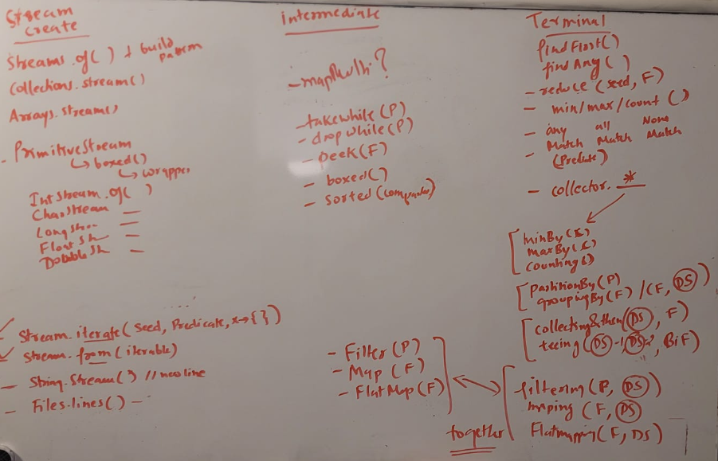

# Java 8
- references
  - java 8 - stream operator - 2 : https://chatgpt.com/c/8857b819-6a75-4dfe-a217-bc6b26c6875b
  - java 8 - stream operator - 1 : https://chatgpt.com/c/83648e41-d8aa-4623-af1c-0236dd664293
  - java 8 - int streams : https://chatgpt.com/c/3679b8bd-9ae4-4906-a46d-9238408c8e20
  - java 8 - int streams pg examples: https://chatgpt.com/c/4616e081-ba31-4587-9343-8d1b2adf142e
  - Java 8 - streams (baeldung) :: https://chat.openai.com/c/5a922567-573c-4788-8b4c-071cda3386e0

---

## 1. New Date and Time API
  - `LocalDateTime`, `LocalDate`, `LocalTime`
  - `ZonedDateTime`
  - `Instant` - from 1 jan 1970. / seconds + nanoSec / number greater than logng
  - [DateTime_1.java](..%2Fsrc%2Fmain%2Fjava%2Fjava8%2FDateTime%2FDateTime_1.java)

---
## 2. Interfaces
- interfaces flexibility - Multiple inheritance, resolve method conflicts
    - `Default` Method {...}
    - static method  {...}
    - final method  {...}
    - above 3 can be private
  
- `@FunctionalInterface` FI - implementation ways:
    - `lambda exp`
    - `method references` 
      - way to refer to methods or constructors without invoking them.
      - further simplify lambda expressions
      - categorizes of FI:
        - Consumer<T> : accepts-T
        - Supplier<T> : produces-T
        - Predicate<T> | BiPredicate<T,U> : accepts-T,U and produces-`boolean`
        - Function<T,R> | BiFunction<T,U,R> : accepts-T,U and produces-R
        - UnaryOperator<T> | BinaryOperator<T> :  accepts-T or T,T and produces-T
        - Runnable : nothing
        - Comparator<T> :  accepts-T,T and produces-`Integer`
        - custom

---
## 3. `Streams` and collections
- Streams API 
- Collection API - new methods.
- Executing a terminal operation makes a stream inaccessible, cant be reused. 
  - trick : create Supplier of streams. `Supplier<Stream> :: get()`
- **stream Pipeline** 
  - source, 
  - intermediate operation(s) (immutable, doesn't change ori collection)
  - single terminal operation 
- `parallelStream`
- Operators (takes lambdas)
  - intermediate : filter(), map(), boxed(), [list1,list2].stream().`flatmap`(list->list.stream()),
  - terminal : Collect(), findAny()-Optional<T>, etc
- `Spliterator`: also used internally by parallel stream 
  - trySplit() : to split an iterator 2 multiple parts to be processed in parallel
  - control behaviour: SIZED, SUBSIZED, ORDERED, NONNULL, IMMUTABLE, and CONCURRENT
```
Characteristic	  Description	                        Example Source

SIZED ?	          Knows exact number of elements	    ArrayList, LinkedList
SUBSIZED ?	      Splits are also SIZED	                Array, ArrayList
ORDERED	          Preserves the order of elements	    LinkedList, TreeSet
NONNULL	          Contains no null elements	            HashSet (without null)
IMMUTABLE	      Cannot be modified during traversal	unmodifiableList()
CONCURRENT	      Can be modified concurrently	        ConcurrentHashMap      
```
- stream of primitives :: (IntStream, LongStream, DoubleStream), `mapToObj`()
  - IntStream.of(1,2,3,4,5).`summaryStatistics`();
- some fact:
  - Function.identity() == x->x, a function that returns its input.
  - List.copyOf(l1),of(l1)  instanceOf  `ImmutableCollections$ListN`
  - stream.collect(Collectors.toList()) --> shortcut :` stream.toList()`

### CREATE 
  - `Stream.of`, `Stream.empty()`,`Stream.builder().add().add()...`, 
  - `Stream.generate(x-{}).limit(5)`, 
  - `Stream.iterate(seed,Predicate,x->{})`, `Stream.iterate(seed,x->{}).limit(5)`
  - `Files.lines(Path.of(file))`,
  - Stream.`from`(Iterable) - J17
  - `Optional`.stream() - J9

### INTERMEDIATE
  - each operator function ,returns another Stream<?> :point_left:
  - **java 8** :
    - `filter(Predicate)`, `map(Function)`, `flatmap(Function)`, `peek(Consumer)`, `distinct()`,  `boxed()`
    - `sorted()` : natural order : comparable,`sorted(Compartor)`,
    - `limit(long)`, `skip(long)`, `peek(Consumer)`
  - **Java 9** : 
    - `takewhile(Predicate)` : 
      - Takes elements from the stream while the predicate is true. 
      - once predicate is false, it will stop taking element. stream ends here.
      - so more likely BREAK.
    - `dropwhile(Predicate)` : 
      - Drops elements from the stream while the predicate is true. 
      - once predicate is false, it will start taking element till end of stream.
  - **jav 16** : 
    - `mapMulti`(`BiConsumer`<T, `Consumer<R>`>) :
      - designed to take each element of the stream,
      - and produce `zero` or more elements, which are then combined into a new stream.
      - ```        
        stream = Arrays.stream(new Integer[] {1,2,3});
        stream.mapMulti( (item, consumer ) -> {
             consumer.accept(item);
             consumer.accept(item);
             consumer.accept(item);
        }).forEach(System.out::print);
        // 111222333
        ```

### TERMINAL
  - each terminal operator function ,returns somethings. notice it. :point_left:
  - **java 8**
    - void `forEach(Consumer)`, `forEachOrdered(Consumer)`
    - void `toArray()`
    - T `min/max(Comparator)` , Long `count()`
    - `reduce`
      - Optional<Integer>  `reduce(BinaryOperator<T>)`, // accumulator ( partial-result, next-element)
      - List<T>            `reduce(T,BinaryOperator<T>)` //  seed, accumulator 
      - List<T>            `reduce(U,BiFunction<U,T>, BinaryOperator<U>)` ** 
        - (seed, accumulator, combiner) -> for parallel processing
        - takes two partial results and combines them into a single partial result.
    - boolean `anyMatch(Predicate)`, `allMatch(Predicate)`, `noneMatch(Predicate)`
    - ?`collect(Collector)` (check new section)
    
  - **java 9**
    - Optional<T> `findFirst()`, `findAny()`
      
### TERMINAL - COLLECTORS 
  - terminal operation >> .collect(Collectors.*)
  - notice **downstream-Collector** below.
  - **java 8**
    - long Collectors.`counting`() : count result after stream-processing.
    - T Collectors.`[min/max]By`(Comparator<T>)
    - String Collectors.`joining`(delimterStr, prefixStr, suffixStr) : Concatenates the input elements into a single `String`
    - U Collectors.`reducing` - 3 variants
      - Collectors.reducing( BinaryOperator) : (u,u)->u
      - Collectors.reducing(seed, BinaryOperator) : (u,u)->u
      - Collectors.reducing(seed, Function, BinaryOperator) :small_red_triangle:
    - Collectors.`collectingAndThen`(**downstream-Collector**.*, collectedValue -> {}) 
    - Map Collectors.`partitioningBy`(Predicate)
    - Map Collectors.`groupingBy` - 2 variants
      - Map Collectors.groupingBy(Function) 
      - Map Collectors.groupingBy(Function, **downstream-Collector**.*) :small_red_triangle:
        ```
         List<Integer> l = List.of(1,2,3,4,5,1,2,3,4,5,1,2,3,4,5);  
         Map<Integer,Long> r12 = l.stream().collect(Collectors.groupingBy(n->n, Collectors.counting()) );
        ```
    - `summarizingInt|Double`(ToIntFunction), `[Averaging|Sumuing][Int|Double]`
       - IntSummaryStatistics stats = stream.collect(Collectors.summarizingInt(String::length));
    - List/Set Collectors.`toList`(),`toSet`(), `toCollection`(LinkedList::new)
    - Map      Collectors.`toMap`(i->k, i->v), `toMap`(i->k, i->v, (existing,replacment)->v) : 3rd agr to resolve duplicate entry/key.
    
  - **java 9**
    - Collectors.`mapping`(transform-Function, downstream-Collector.*)
      - transform a stream of collections into a single stream  and collect the results using a downstream collector, at same time.
      - like map().collect(Collector.*)
    - Collectors.`Filtering`(filter-Function, downstream-Collector.*) :
      - filter a stream of collections into a single stream  and collect the results using a downstream collector, at same time.
      - like filter().collect(Collector.*)
    - Collectors.`FlatMapping`(flapmap-Function, downstream-Collector.*): 
      - flatten a stream of collections into a single stream  and collect the results using a downstream collector, at same time.   
      - like flatmap().collect(Collector.*)
  
  - **java 10,11**
    - Collectors.`toUnmodifiableSet`(),`toUnmodifiableList`()
    - Collectors.`toUnmodifiableMap`(Function,Function), `toUnmodifiableMap`(Function,Function,BiFunction)
      
  - **Java 12**
    - Collectors.`teeing`(**downstream-Collector-1**.*, **downstream-Collector-2**.*, (result-1,result-2)->{})
    - fact: more like Collectors.`collectingAndThen`(**downstream-Collector**.*, result -> {})

> 1.  IMPORTANT: understand `downstream-Collector` behaviour
>     - eg: Collectors.`groupingBy`(Classify-Fn, Collectors.`Filtering( filter Fn , Collectors.toList())` )
>     - eg: Collectors.`groupingBy`(Classify-Fn, Collectors.`flatmapping( filter Fn , Collectors.toList())` )
        
---
## 4. `Optional<T>`
  - container object that may or may not contain a value.
  - represent optional values, instead of using null references.
  - safer alternative to handling null values.
  - Example. (`can chain them`)
    - Create:
      - Optional.`of`(value) --> if value=null, gives NPE.
      - Optional.`ofNullable`(value) -->  value can be null.
    - get
      - `get`() --> can give `NoSuchElementException`
      - `orElse`(defaultValue)
      - `orElseGet`(Supplier<T>)
      - `orElseThrow`(Supplier<X>), X is exception type
    - value presence
      - `isPresent`() , `isEmpty`()
      - `ifPresent`(Consumer<T>) - if true, execute consumer
      - `ifPresentOrElse`(Consumer (x)->{}, Runnable ()->{}); J9
    - more(try)
      - `filter`( Predicate<T> )
      - `map`(Function<T,R>)
      - `flatmap`()
 
---

---
## programs
1. program with Optional<`List<Integer>`>  and  Optional<`Integer`>
2. Spliterator - parallel stream  
3. Flattening Nested Collections in Java - recursively call flatMap(c::m) 
4. Zipping Collections in Java : ext lib: `StreamEx.zip`(stream1,stream2, (s1-item,s2-item)->{...})
   - <artifactId>streamex</artifactId>
   - or write custom code.
5. Immutable collection:
   - Guava library :: ImmutableList/Set/Map::copyOf(c)
   - j9+ :: List.copyOf(l),  Set.copyOf(s) ,  Map.copyOf(m)